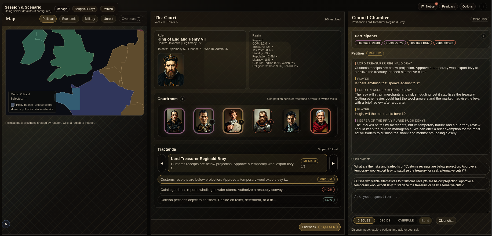

# The Court (spec kit)

Conversational GSG concept: a deterministic nation model with a generative court UI.



## Notes

- There are some kinks in the maps and scenario generation yields varying results.
- For testing, use the default England 1492 scenario.
- Your experience will vary by LLM (default config uses OpenAI gpt-4o-mini; Groq OSS-20b and OpenRouter are supported; images are Black Forest Schnell via the free Hugging Face tier).
- Design principle: keep the UI static and content generative to keep costs low and the learning curve flat.
- Maps are not generated here because of consistency issues.
- Feedback is stored in the DB per deployed instance; multiple users are supported, but auth is basic.
- Development is set up for Codex (copy and adapt `AGENTS.md` and `.codex/skills` for your agent).

## Gameplay options (UI)

Open the Options panel in the lower-right corner:

- Petition inflow: low/normal/high controls how many new petitions arrive each week.
- Petition cap: maximum open petitions before new arrivals pause (default 10).
- Continuing matters: petitions start with a short “Remember we did …” reminder; open the `log` button on that message to see the exact prior conversation transcript.

## Engine flow


Only Actions mutate state; LLM output is parsed into actions, then applied deterministically by the engine.

## Quick start (dev)

Prereqs: Node 20+, pnpm 9+, Docker.

```bash
pnpm install
cp .env.example .env
# add at least one LLM key in .env

docker compose up -d
pnpm --filter @thecourt/server db:migrate
pnpm dev
```

- Web: http://localhost:5173/court/
- Server: http://localhost:8787/health

### Optional: local launcher

```bash
./scripts/run-court.sh
```

Stops with:

```bash
./scripts/stop-court.sh
```

## Commands

```bash
pnpm -r lint
pnpm -r typecheck
pnpm -r test
pnpm -r build
```

## Project layout

- `apps/web/` UI (map | court | chat)
- `apps/server/` API, persistence, LLM providers
- `packages/engine/` deterministic sim core
- `packages/shared/` Zod schemas + shared types
- `docs/` specs and prompts
- `schemas/` JSON Schemas for IO + persistence

## Safety & data notice

- This game stores gameplay state in Postgres.
- Guest accounts are real accounts with anonymized identifiers.
- If you provide email/display name, that personal data is stored server-side.
- Outputs are AI-generated and may be incorrect or inappropriate.

## Contributing

Contributions welcome. See `CONTRIBUTING.md` for setup, workflow, and architectural rules.

## License

MIT (see `LICENSE`).
